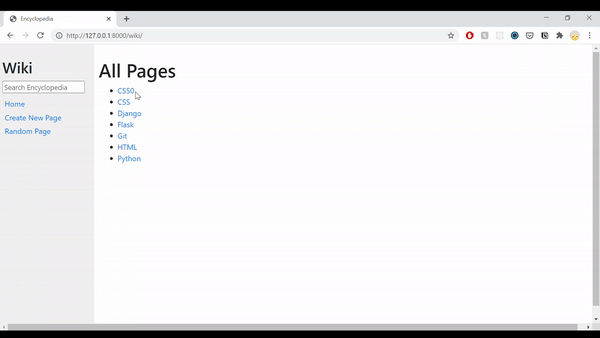
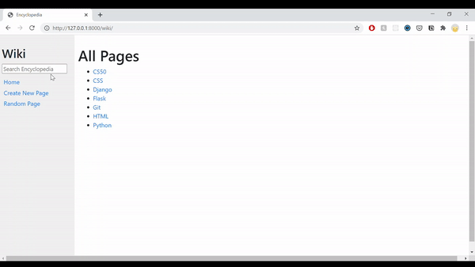
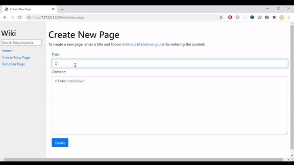
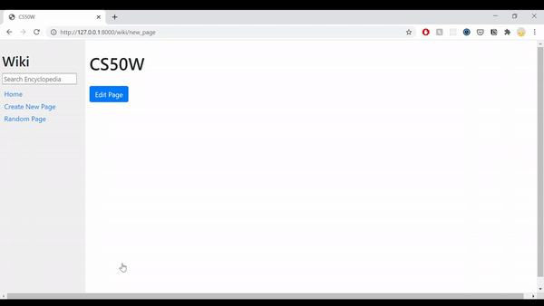
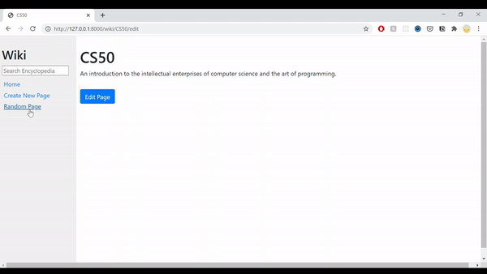

# Wiki
A Wikipedia-like online encyclopedia web application. The main framework for this project is Django. Storing encyclopedia entries using a markup language called Markdown.

## Overview
This is my course submition for CS50's Web Programming with Python and JavaScript. The project specifications are listed [here](https://cs50.harvard.edu/web/2020/projects/1/wiki/).

# Architecture
### Frontend
* Languages:
  * HTML
  * CSS

* Main Framework/Libraries:
  * Django Templates
  * Bootstrap

### Backend

* Language:
  * Python

* Main Framework/Libraries:
  * Django

### Project Demo
#### Encyclopedia Page Selections

#### Search Encyclopedia Entry Page

#### Create New Encyclopedia Entry Page

#### Edit Encyclopedia Entry Page

#### Select Random Encyclopedia Entry Page

